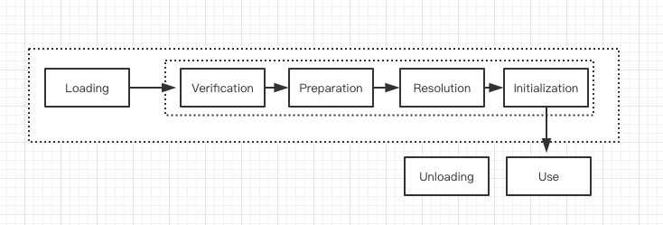
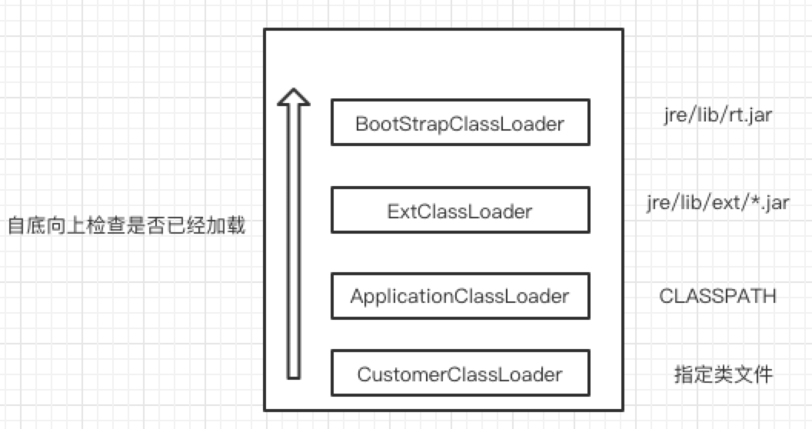
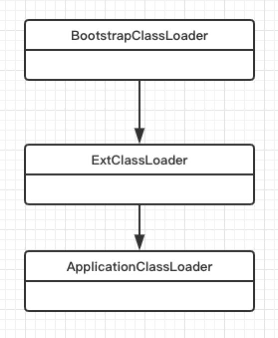

# 详情

​     ClassLoader 负责动态地加载JAVA  classes到JVM 中。ClassLoader 属于JRE的一部分，因此JVM 不需要知道底层的文件系统。

​    ClassLoader 并不会一次性全部加载到内存中，但是当Application 需要时会加载。

#类的生命周期



## Loading

查找并加载类的而进制，在加载阶段，虚拟机需要完成以下散件事情：

- 通过一个类的全限定名来定义获取其定义的二进制字节流
- 将这个字节流所代表的静态存储结构转化为方法运行时的数据结构
- 在java对中生成一个代表这个得对象，作为对方法区中这些数据的访问入口

相对于其他类加载的其他阶段而言，加载阶段是可控性最强的阶段，因为开发人员既可以使用系统提供的类加载器来完成加载，也可以自定义自己的类加载器来完成加载。

加载阶段完成后，虚拟机外的二进制字节流就按照虚拟机所需的格式存储在方法区中，而且在java 堆中也创建一个java.lang.Class类的对象，这样便可以通过该对象访问方法区中的这些数据。

## Link

链接器负责链接class或者interface。由于此组件涉及分配新的数据结构，因此它可能会抛出outOfMemory

Error异常，链接器将主要执行以下三个时间：

- 验证(Verification)，确保被加载的类的正确性

  - 验证字节流是否符合class文件格式规范。如果不符合将抛出VerifyError。比如验证是否0xCAFEBABE开头，主次版本是否在当前虚拟机的处理范围、常量池中的常量是否有不被支持的类型。
  - 元数据验证，对字节码描述的信息进行语义分析以保证其描述的信息符合java语言规范的要求，比如是否具有除了java.lang.object之外的父类。
  - 字节码验证，通过数据流和控制流分析，确定程序语义是否合法的、符合逻辑的
  - 符号引用验证，确保解析动作正确执行

  验证阶段是非常重要的，但不是必须的，它对程序运行没有影响，如果所引用的类经过反复验证，可以通过-Xverifynon参数来关闭大部分的类验证措施，可以缩减JVM类加载的时间

- 准备(Preparation)，为·为静态变量· 分配内存，并将其初始化为默认值

  准备阶段是正式为类变量分配内存并设置类初始值的阶段，这些内存将在方法区中分配。对于该阶段主要有以下关键点：

  1. 此时进行内存分配的仅包括类变量(static)，而不包括实例变量，实例变量会在对象实例化时随着对象一块分配在java堆中

  2. 这里设置的初始值通常情况下是数据类型默认的值，比如(0,0L,null,false)等，而不是在java代码中显示赋予的值

     > 假设一个类的变量定义为 ‘public static int value=3‘ ，那么变量value在准备阶段过后的初始值为0，而不是3，因为这时尚未执行java的方法，而把value赋值为3的指令是在程序编译之后，存放在<clinit>()方法中，所以value赋值为3的动将在初始化阶段才会执行。以下几点需要重点关注：
     >
     > - 对于基本类型来说，类static变量和全部变量，如果不显示的对其进行赋值而直接使用，则系统会为其赋予默认的值，而对于局部变量来说，使用之前必须显示的为其赋值，负责编译时不通过
     > - 对于同时被static和final修饰的常量，必须在声明的时候显示的赋值，否则编译器不通过，而只被final休息的常量则即可以在声明时显示的为其赋值，也可在类初始化时显示的赋值。总之必须在显示之前赋值，系统不会为其赋予默认的零值
     > - 对于引用数据类型reference来说，如数组引用、对象引用，如果没有对其显示的赋值而直接使用，系统会为其赋予默认零值-null
     > - 如果在数组初始化时没有对数组中的各元素赋值，那么元素将根据其对应的数据类型赋予零值。

  3. 如果类字段的字段属性表中存在constantValue属性，即同时被final和static修饰，那么在主备阶段变量value将会被初始化为ConstValue 属性指定的值

     > 假设 ’public static final int value=3‘ 编译时javac 将会为value 生成ConstantValue 属性，在准备阶段虚拟机将会根据ConstantValue的设置将value 赋值为3。我们可以理解为 static final修饰的常量在编译期中就将结果放入调用它的类的常量池中

- 解析把类中的符号引用转换为直接引用

  解析阶段是虚拟机将常量池内的符号引用替换为直接引用的过程，解析动作主要针对类或者接口、字段、类方法、接口方法、方法类型、方法句柄和调用点限定符等7类符号引用进行。符号引用就是一组符号来描述目标，可以是任何字面量。直接引用就是直接指向目标的指针、相对偏移量或者一个简洁定位到目标的句柄

- 初始化

  初始化，为类的静态变量赋予正确的初始值，JVM 负责对类 初始化，主要对类变量(static)进行初始化。在Java中对类变量进行初始值设定有两种方式：

  -  声明static 变量时指定的初始值
  - 使用静态代码块为类变量指定初始值

  

  JVM初始化步骤

  - 假如这个类还没有被加载和连接，则程序先加载并连接此类
  - 假如该类的直接父类还没有被初始化，则先初始化其直接父类
  - 加入类中有初始化语句，则系统一次执行这些初始化语句

  类初始化时机：只有当对类的主动使用时才会导致类的初始化，类的主动使用包括如下：

  - 创建类实例，如new
  - 访问某个类或者接口的静态变量，或者对该静态变量赋值
  - 调用该类的静态方法
  - 反射(Class.forName(""))
  - 初始化某个类的子类，则其父类也会被初始化
  - jvm启动时被标明为启动类的类，如·Java Test·，直接使用java.exe命令来运行某个类

  





###BootStrap ClassLoader

该类型负责将java 核心代码(rt.jar)，以及其他java.lang*的类文件加载进jvm。BootStrap loader 是所有JVM 都需要实现的，且由c/c++实现。
由于Bootstrap loader通过c++实现，所以通过getClassLoader 获取将会返回null。

### Extension ClassLoader

ExtClassLoader是BootstrapLoader的一个子classloader,负责加载extension classpath(JDK_HOME/jre/lib/ext/*)。由java 实现

### ApplicationClassLoader

也称为SystemClassloader，它是ExtClassLoader的子loader，负责加载CLASS_PATH路径下的文件。实现类为

###CustomerClassLoader
我们可以加入自定义的类加载器，因为JVM 自带的ClassLoader只是从本地文件系统加载标准的class 文件，因此如果编写了自己的loader便可以做到以下几点：
- 在执行非置信代码之前，自动验证数字签名
- 动态创建符合用户特定需要的定制化构建类
- 从特定的场所取得class文件，比如数据库、网络而不局限于本地系统

###ClassLoader的关系demo
我们先来看一段代码

```java
fun main() {
    println("ClassLoader of this class:${TradeTransaction::class.java.classLoader}")
    println("ClassLoader of this Logging:${Logging::class.java.classLoader}")
    println("ClassLoader of this String:${String::class.java.classLoader}")
}
```

```
ClassLoader of this class:sun.misc.Launcher$AppClassLoader@18b4aac2
ClassLoader of this Logging:sun.misc.Launcher$ExtClassLoader@63947c6b
ClassLoader of this String:null
```

##ClassLoader加载机制
- 全盘负责， 当一个类加载器负责加载某个class 时，该class所依赖的和引用其他class也将由该classloader负责加载，除非显示的使用另一个类加载
- 父类委托，先让父类加载器师徒加载该类，只有父类加载器无法加载该类时才尝试从自己的类路径中加载该类
- 缓存机制，缓存机制将会保证所有加载过的class都会被缓存，当程序中需要使用某个class时，类加载器先从缓存区寻找该class，只有缓存区不存在，
系统才会读取该类对应的二进制数据，并将其转换成class对象，存入缓存区。所以当class 修改之后必须重启JVM
###双亲委派模型
如果一个类加载器收到了类加载的请求，并不会自己去加载这个类，而是先询问父加载器去完成，依次向上，所有的委托最终传递到顶层的启动类加载器中，只有当
父加载器在它的搜索范围中没有找到所需的类时，子加载器才会加载该类
> - 当AppClassLoader加载一个class 时，它首先并不会先自己尝试加载这个类，而是把类加载的请求委托父加载器ExtClassLoader去完成
> - 当ExtClassLoader加载一个class 时，它先委托给BootStrapClassLoader 去加载
> - 当 BootStrapClassLoader 加载一个class时，先从$JAVA_HOME/jre/lib/rt.jar 去尝试加载
> - 如果 BootStrapClassLoader 未加载到该类则ExtClassLoader 尝试在$JAVA_HOME/jre/lib/ext/* 去尝试加载，
> - 如果 BootStrapClassLoader 加载失败，则AppClassLoader 才会尝试加载，如果还是加载失败则会抛出 ClassNotFoundClassException
```java
 protected Class<?> loadClass(String name, boolean resolve)
        throws ClassNotFoundException
    {
        synchronized (getClassLoadingLock(name)) {
            // First, check if the class has already been loaded
            Class<?> c = findLoadedClass(name);
            if (c == null) {
                long t0 = System.nanoTime();
                try {
                    if (parent != null) {
                        c = parent.loadClass(name, false);
                    } else {
                        c = findBootstrapClassOrNull(name);
                    }
                } catch (ClassNotFoundException e) {
                    // ClassNotFoundException thrown if class not found
                    // from the non-null parent class loader
                }

                if (c == null) {
                    // If still not found, then invoke findClass in order
                    // to find the class.
                    long t1 = System.nanoTime();
                    c = findClass(name);

                    // this is the defining class loader; record the stats
                    sun.misc.PerfCounter.getParentDelegationTime().addTime(t1 - t0);
                    sun.misc.PerfCounter.getFindClassTime().addElapsedTimeFrom(t1);
                    sun.misc.PerfCounter.getFindClasses().increment();
                }
            }
            if (resolve) {
                resolveClass(c);
            }
            return c;
        }
    }

```

# 