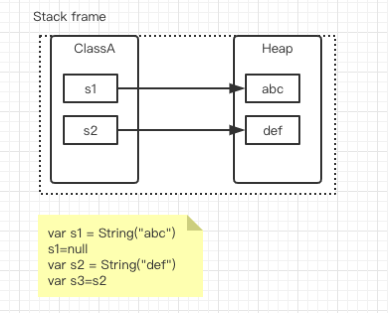
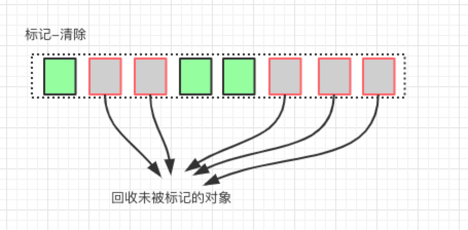

#对象存活判断
判断对象是否存活有两种方式：
- 引用计数
- 可达性分析
 
##引用计数
   每个对象有一个引用技术属性，新增一个引用时技术加1，引用释放时，技术减1，计数为0时可以回收。此方法简单且效率高，但是无法解决对象相互引用的问题。
   示例1：
   
   如图，s1 = null 计数-1，为0，可回收
   s3=s2,还在引用s2，不会-1 不会回收
   示例2：
   ```java

public class ReferenceCountingGC {

    public Object instance = null;

    public static void testGC() {
        
        //step 1
        ReferenceCountingGC objA = new ReferenceCountingGC();
        //step 2
        ReferenceCountingGC objB = new ReferenceCountingGC();
        //相互引用
        //step 3
        objA.instance = objB;
        //step 4
        objB.instance = objA;

        //step 5
        objA = null;
        //step 6
        objB = null;

        //假设在这行发生CG，objA和objB是否能被回收？   不能！！！！
        System.gc();
    }

    public static void main(String[] args) {
        testGC();
    }
}
```
   
##可达性分析
   从GC Roots 开始向下搜索，搜索所走过的路径称为引用链，当一个对象到GC Root没有任何引用链相连时，则证明此对象是不可用的。
   GC Root 包括：
   - 虚拟机栈中引用的对象(局部变量表)
   - 方法区中类静态属性实体引用的对象
   - 方法区中常量引用的对象
   - 本地方法栈中JNI引用的对象
   
#回收策略
##标记清除
如算法名一样，算法分为`标记`，`清除` 两个阶段：首先标记出所有需要回收的对象，在标记完成之后统一回收掉所有被标记的对象。后续的算法均基于此进行改进
  
  标记清除缺点如下：
  - 效率低，标记和清除总共需要两次遍历，效率都不高；
  - 空间问题，标记清除算法会产生大量的不连续的内存碎片，空间碎片过多可能会导致在需要分配较大对象时无法满足而不得不提前触发另一次GC。
##复制

##标记整理
##分代算法