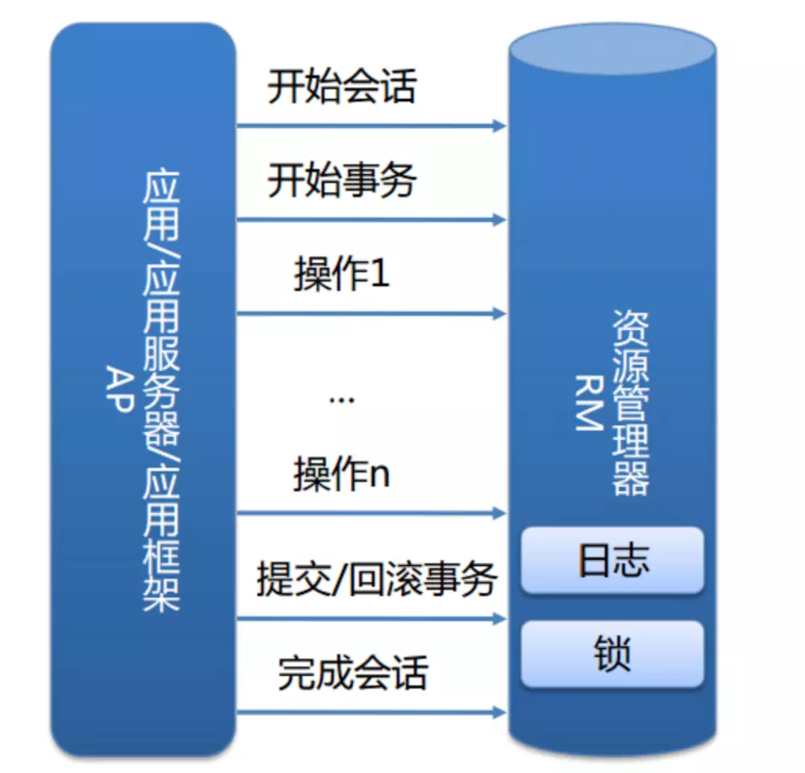
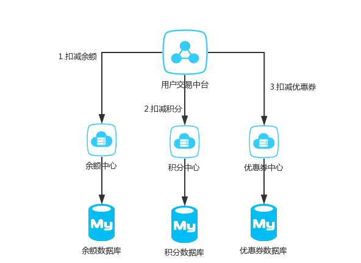

#什么是事务
事务提供一种机制，将一个活动涉及的操作划入一个不可分割的执行单元，组成事务的所有操作只有在所有操作都正确执行下才能提交，只要其中任一操作执行失败，其它的所有操作都要回滚。简单的说就是"要么所有人都不做，要么所有人都要作对"。
#数据库本地事务
##不得不说的ACID
数据库事务不得不说的四个数据库特性ACID：
* Atomicly 原子性
    >一个事务的所有操作要么全部完成，要么全部取消，不会结束在中间某个环节，当执行过程中某个步骤发生错误，所有的操作都要回滚到事务开始的状态
* Consistency 一致性
    >事务的一致性是指在一个事务执行之前和执行之后数据库都必须处于一致性状态。如果事务成功的执行，那么系统中所有的变化将正确应用，系统处于有效状态。如果事务中出现错误，那么系统中所有的变化都将自动回滚，系统返回原始状态
* Isolation 隔离性
    >并发操作中，不同的事务对相同的数据进行修改时，每个事务都有各自的完整的数据空间
* Durability 持久性
    >当事务成功执行之后，它对数据库所做的更新必须永久保存下来，即使发生了系统崩溃，重新启动后数据库将恢复到事务执行成功之后的状态。
##InnoDB 事务实现原理
本地事务由资源管理器管理

   
而数据库的ACID 是通过InnoDB日志和[锁](../locks/Locks.MD)来保证。事务的隔离性是通过数据库锁机制实现的，持久性通过Redo log 来实现，原子性和一致性通过Undo log 实现。

Undo log 的原理很简单，为了满足事务的原子性，在操作之前，先将数据进行备份到undo log，然后再进行数据修改，如果出现了错误或者用户执行rollback 语句，系统系统从undo log\n
中的备份数据恢复到事务开始之前的状态。

与undo log 正好相反，redo log记录的是新数据的备份。在事务提交之前，只要将redo log 持久化即可，不需要将数据持久化，当系统崩溃时，虽然数据没有持久化，但是redo log已经
持久化，系统可以根据redo log 进行恢复到最新状态。

[ACID实现原理](./ACID%20principle.MD)

#分布式事务

分布式事务就是指事务的参与者、支持事务的服务器、资源服务器以及事务管理器分别位于不同的分布式系统的不同节点之上。
简单的说，就是一次大的操作由不同的小操作组成，这些小的操作分布在不同的服务器上，且属于不同的应用，分布式事务需要保证这些小操作要么全部成功，要么全部失败。
本质上来说，分布式事务就是为了保证不同数据库的数据一致性。

##分布式事务产生的原因

从本地事务可以发现事务可以分为两个整体部分，一个是Service 多节点，一个是Resource多节点。

###Service 多节点
随着互联网技术的发展，微服务化已成为常态。一个简单的例子，用户资产分为多个部分，比如余额、积分、优惠券等等，在公司内部可能不同的资产就由不同的Service
开发维护，这样的话，如果余额扣减成功积分能否扣减成功。

###Resource 多节点

以支付宝转账业务为例，小A 要给小B 转账 100块，但是小A的账户可能存在北京的数据库，小B 的账户可能存在上海，所以Service 扣减时难以保证同时成功

随着Service多节点以及Resource 多节点的问题出现，进而提出分布式事务

##分布式事务的基础

###CAP 定理
* C(Consistency一致性) 等同于所有节点访问同一份最新的数据副本
* A(Available可用性) 每次请求都能获取到非错的响应——但是不保证获取的数据为最新数据
* P(Partition tolerance分区容错性) 当出现网络分区后，系统能够继续工作。打个比方，这里个集群有多台机器，有台机器网络出现了问题，但是这个集群仍然可以正常工作

根据定理，分布式系统只能满足三项中的其中两项而不可能满足全部的三项。这是因为在分布式系统中，网络是不可靠的，分区其实是一个必然现象，如果我们选择了CA，而放弃P
 那么当发生P 现象时，为了保证一致性，这个时候必须拒绝请求，但是A又不允许，所以分布式系统理论上不可能选择CA 架构，只能选择CP或者AP架构
 
 * CP 架构，放弃可用性
 * AP 架构，放弃一致性